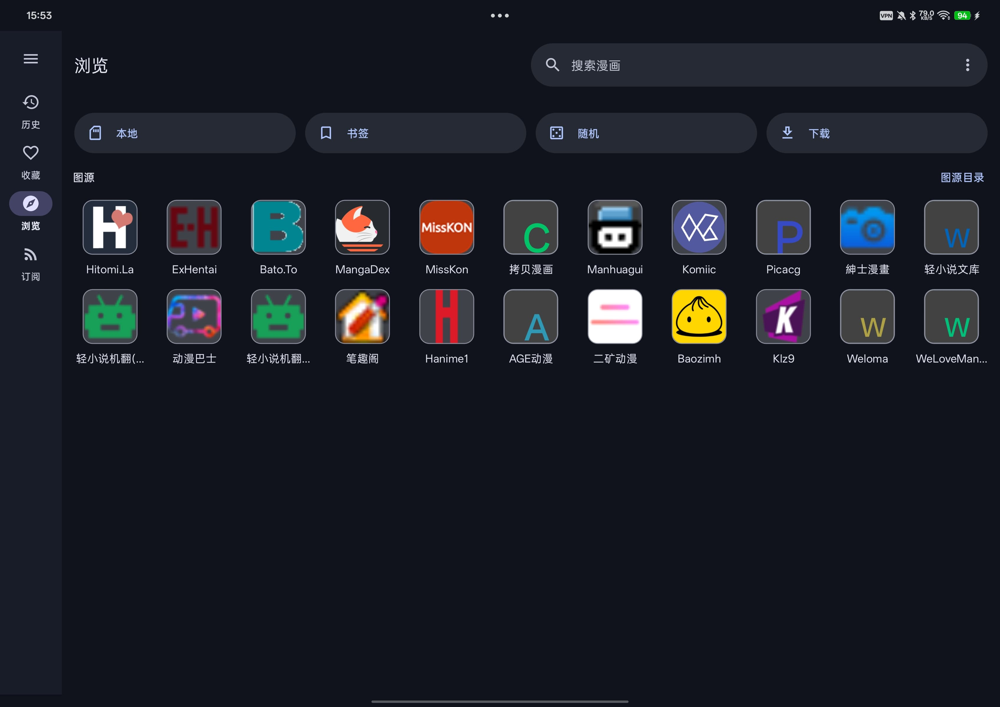
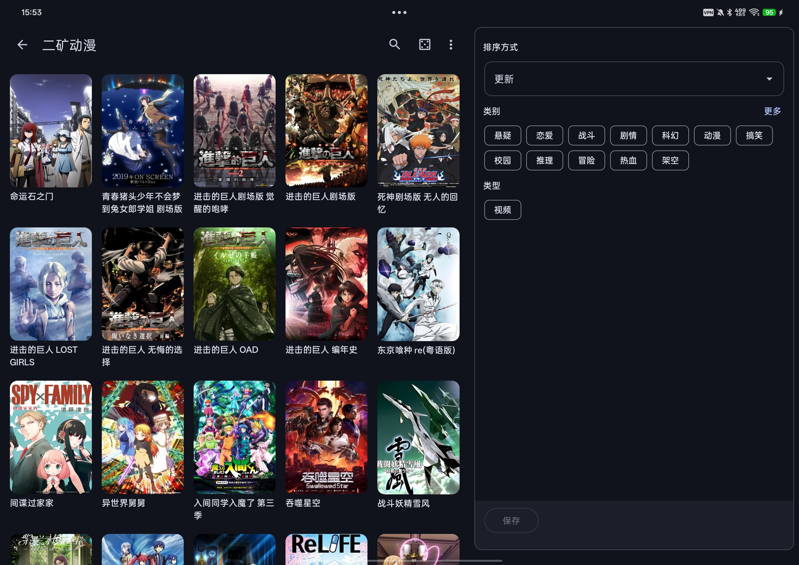
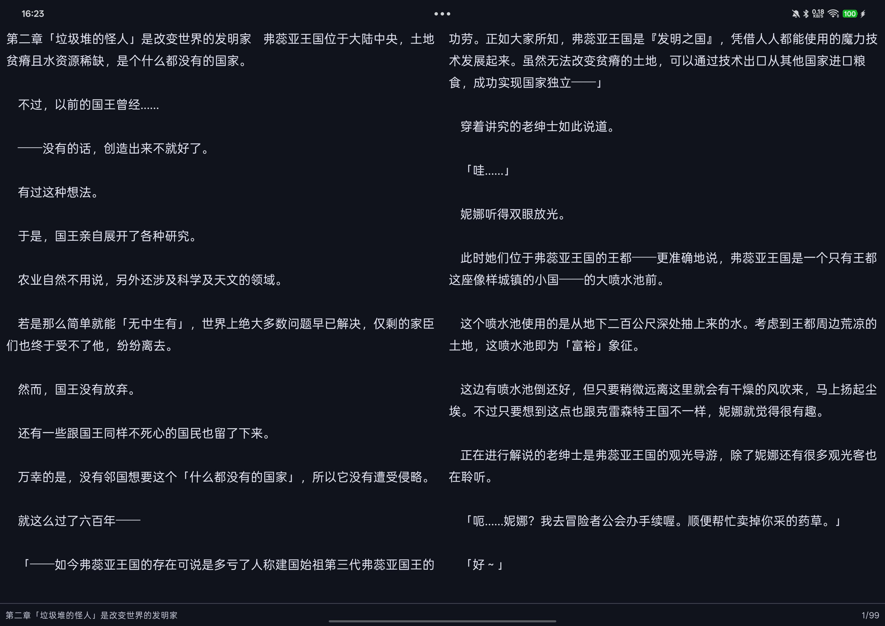

# Kototoro


[](https://discord.gg/xBXvPz7tr7)
[](https://kototoro-app.github.io/Kototoro/)
[](https://kototoro-app.github.io/Kototoro/getting-started)
[](https://kototoro-app.github.io/Kototoro/entity-system)
[](https://kototoro-app.github.io/Kototoro/automatic-translation)

Kototoro is an open-source Android app that brings manga, novels, and video into one reader. It combines broad source compatibility with local OCR + translation, video super-resolution, and WebDAV-based multi-device sync.

> **Compose-first, end to end**: Kototoro may be one of the first genuinely all-Compose manga, novel, and video reading apps. Compose is not just used for the surrounding screens: the comic/novel reader and the video player are Compose too. The former XML, Fragment, and hybrid transition layers have been reduced to the bare minimum, so the core reading and playback experience is now built around Jetpack Compose.
>
> **中文简介**：Kototoro 是一款开源的 Android 应用程序，将漫画、小说和视频整合到了一个阅读器中。它结合了极好的图源兼容性、本地 OCR + 机器翻译、视频超分辨率加载以及基于 WebDAV 的多设备同步功能。
>
> **Compose 优先，端到端构建**：Kototoro 可能是最早一批真正意义上的全 Jetpack Compose 漫画、小说和视频阅读器之一。Compose 不只是用于外围页面，漫画/小说阅读器和视频播放器本身也全部采用 Compose 构建。旧的 XML、Fragment 以及混合过渡层已经基本清空，核心阅读与播放体验如今都围绕 Jetpack Compose 打造。

## Why Kototoro / 核心特性

- **A genuinely all-Compose reading experience** — the manga/novel reader and video player are Compose as well as the surrounding UI; legacy XML, Fragment, and transitional hybrid layers are now largely gone
  *(真正全 Compose 的阅读体验：漫画/小说阅读器和视频播放器与外围界面一样采用 Compose，旧 XML、Fragment 和过渡态混合层已基本清空)*
- One app for manga, novels, and video 
  *(一个应用搞定漫画、小说和视频)*
- Local automatic OCR + translation directly inside the reader 
  *(阅读器内直接集成强大的本地自动 OCR + 机器翻译)*
- Video super-resolution (Anime4K / NCNN), DLNA casting, subtitle and audio track selection 
  *(视频超分加载、DLNA 投屏播放、外挂字幕与音轨选择)*
- Tracking discovery across MAL, Kitsu, AniList, Bangumi, Shikimori, and MangaUpdates 
  *(支持 Bangumi 等多平台进度追踪与发现)*
- Broad source support: Mihon, Aniyomi, IReader, Legado, TVBox extensions + dynamic parsers 
  *(广泛的图源/插件支持：包含 Mihon、阅读、TVBox 等集成)*
- Entity system and organize tools — keep favorites, history, tracking, and source projections under stable work identities
  *(实体体系与实体整理：用稳定作品身份统一收藏、历史、追踪与来源投影)*
- Local file import: CBZ, EPUB, TXT, MKV, MP4 and more 
  *(本地文件导入，支持 CBZ、EPUB、TXT、MKV 等格式)*
- Dynamic zero-overhead UI plugins via external classloaders
  *(通过外部 classloader 实现的零开销动态 UI 插件)*
- Fast pure-Kotlin OTA delta updates (bspatch) 
  *(纯 Kotlin 实现的快速 OTA 增量更新)*
- Site favorites import and synchronization for supported services 
  *(站点收藏导入与同步)*
- Built-in browser with Cloudflare challenge bypass, with automatic background handling inspired by kotatsu-redo 
  *(内置浏览器，支持 Cloudflare 验证绕过)*
- Reading statistics, quick-access widget, and Telegram backup bot 
  *(阅读统计、快捷桌面挂件、Telegram 备份机器人)*

## Start Here / 开始使用

- Download the latest APK from [Releases](https://github.com/Kototoro-app/Kototoro/releases) *(下载最新版本)*
- Complete the in-app **Setup wizard** right after installation to configure GitHub mirrors, download core source plugins, and set up your content types. *(安装后请直接完成向导设置)*
- Read the [Documentation Website](https://kototoro-app.github.io/Kototoro/)
- Follow [Getting Started](https://kototoro-app.github.io/Kototoro/getting-started) for detailed wizard instructions and next steps
- Learn the core product surface in [Reader Features](https://kototoro-app.github.io/Kototoro/reader-features)
- Understand works, projections, duplicate cleanup, and source binding in [Entity System And Organize Guide](https://kototoro-app.github.io/Kototoro/entity-system)
- Set up [Automatic Translation](https://kototoro-app.github.io/Kototoro/automatic-translation)
- Set up [Source Integrations](https://kototoro-app.github.io/Kototoro/source-integrations)
- Set up [WebDAV Sync](https://kototoro-app.github.io/Kototoro/webdav-sync)
- Check [FAQ](https://kototoro-app.github.io/Kototoro/faq) and [Troubleshooting](https://kototoro-app.github.io/Kototoro/troubleshooting) if something does not work
- See [Development](https://kototoro-app.github.io/Kototoro/development) and [Contributing](https://kototoro-app.github.io/Kototoro/contributing) if you want to work on the project

## External Source Ecosystems

Kototoro supports several important external source ecosystems. These repositories are a key part of real-world setup for many users.

### Common Mihon source repositories

- [Keiyoushi Extensions](https://github.com/keiyoushi/extensions)
- [Yuzono Tachiyomi Extensions](https://github.com/yuzono/tachiyomi-extensions)
- [LittleSurvival CopyManga Copy20](https://github.com/LittleSurvival/copymanga-copy20)

### Common Aniyomi source repositories

- [Kohi-den Extensions Source](https://github.com/Kohi-den/extensions-source)
- [Yuzono Anime Extensions](https://github.com/yuzono/anime-extensions)

### Common Legado source repository

- [XIU2 Yuedu](https://github.com/XIU2/Yuedu)

For setup details, see [Source Integrations](https://kototoro-app.github.io/Kototoro/source-integrations).

## Screenshots / 界面截图

<div align="center">
    
    
    
    
</div>

## Contributing

Issues and pull requests are welcome. Start with [Contributing](https://kototoro-app.github.io/Kototoro/contributing).

## Disclaimer

The developer(s) of this open-source application does not have any affiliation with the content providers available, nor do the developers maintain or govern any extension repositories. This application hosts and bundles zero content. All content parsing is strictly provided by user-installed, third-party extensions and sources. The developers assume no liability or responsibility for any content accessed through user-configured endpoints.

## License

```text
Copyright © 2024-2026 Kototoro Open Source Project

Licensed under the Apache License, Version 2.0 (the "License");
you may not use this file except in compliance with the License.
You may obtain a copy of the License at

    http://www.apache.org/licenses/LICENSE-2.0

Unless required by applicable law or agreed to in writing, software
distributed under the License is distributed on an "AS IS" BASIS,
WITHOUT WARRANTIES OR CONDITIONS OF ANY KIND, either express or implied.
See the License for the specific language governing permissions and
limitations under the License.
```

## Acknowledgements

- [Mihon](https://github.com/mihonapp/mihon)
- [Yomihon](https://github.com/yomihon/yomihon)
- [kotatsu-redo](https://github.com/Kotatsu-Redo/Kotatsu-Redo) for the implementation inspiration behind automatic background handling of Cloudflare detection
- [Venera](https://github.com/venera-app/venera)
- [Kazumi](https://github.com/Predidit/Kazumi)
- [Light Novel Yuedu Source](https://github.com/ZWolken/Light-Novel-Yuedu-Source)
- [legado-with-MD3](https://github.com/HapeLee/legado-with-MD3)
- [RealCUGAN-ncnn-Android](https://github.com/omeshi1/RealCUGAN-ncnn-Android)
- [manga-translator-ui](https://github.com/hgmzhn/manga-translator-ui)

## Contact / 联系方式

- Discord: [Join Server](https://discord.gg/xBXvPz7tr7)
- QQ Group: 560955275
- GitHub Issues: [Issue Tracker](https://github.com/Kototoro-app/Kototoro/issues)
